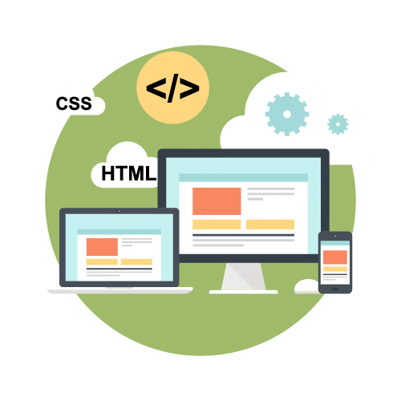

# Maquetación web con HTML 5 + CSS

> Curso de Maquetado Web |   
> Jueves 10hs (Arg) |  
> Código: 53791 |  
> sensei: Marcos Pinardi |

## Definición

Maquetado web es: volcar a código HTML y CSS el proyecto web que vayamos a relizar.

## Requisitos de software

1. un browser
2. un IDE o Editor de código

   Sublime Text 3 https://www.sublimetext.com/   
   Visual Studio Code https://code.visualstudio.com/  
   Brackets http://brackets.io/  
   Atom http://atom.io/  
   
